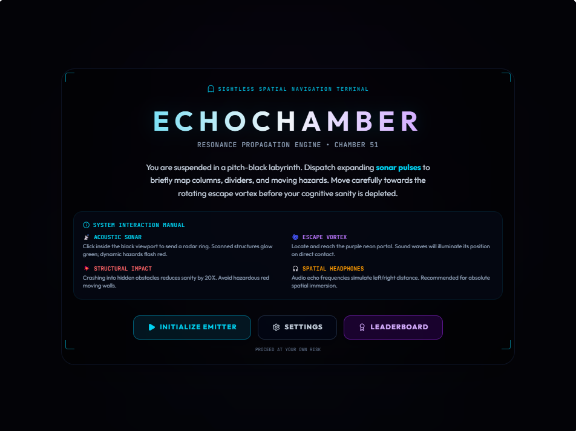

<!--  -->

# 🧩 Echo Chamber Puzzle

Echo Chamber Puzzle: An immersive full-stack web game featuring a unique sonar-based navigation mechanic. Built to challenge player perception, it integrates a React-based frontend with a robust Node.js/Express backend and MongoDB for real-time leaderboard persistence. Developed with a focus on clean architecture, real-time rendering, and solving complex production-level deployment challenges.

---

### 🛠 Tech Stack
| Tier | Technology |
| :--- | :--- |
| **Frontend** | React, Tailwind CSS, HTML5 Canvas |
| **Backend** | Node.js, Express.js |
| **Database** | MongoDB (via Mongoose) |
| **Tooling** | Vite, Git, VS Code |

---

### 🎮 Gameplay Mechanics
- **Sonar Ping:** Tap/Click to emit a pulse that temporarily reveals obstacles in your vicinity.
- **Atmospheric Feedback:** Distance-based pitch modulation and haptic vibration for an immersive experience.
- **Difficulty Scaling:** Levels progressively grow darker and larger, requiring better navigation skills.
- **Persistent Leaderboard:** Integrated backend stores your fastest escape times.

---

### 🚀 Getting Started

#### Prerequisites
- Node.js (v20.9.0 or higher)
- MongoDB Atlas Account

- #####
- 
💡 Key Learning Outcomes
Full-Stack Integration: Managing API communication between React and Express.

Canvas API: Mastering complex real-time rendering and geometry math for game mechanics.

Database Management: Implementing schema-based data storage and retrieval in MongoDB.

Network Optimization: Handling asynchronous requests and resolving environment-based connection challenges.
